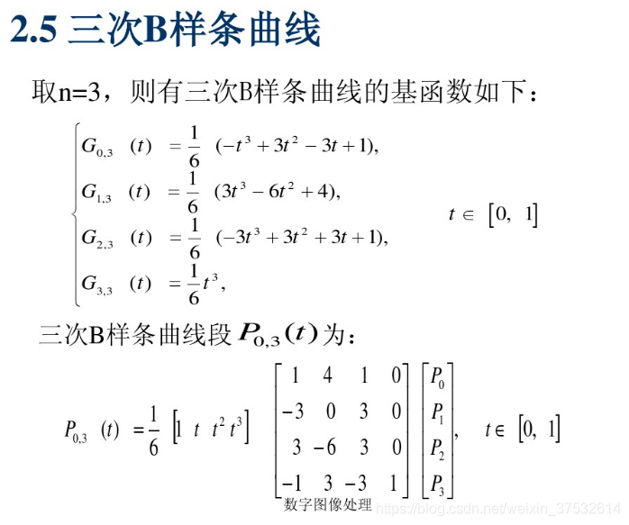
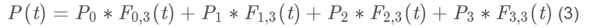
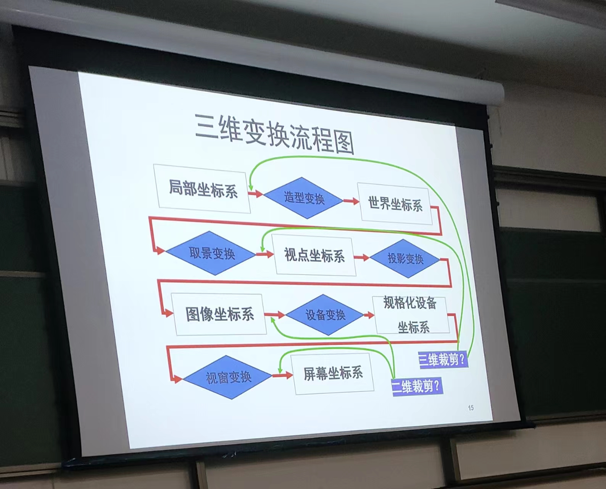
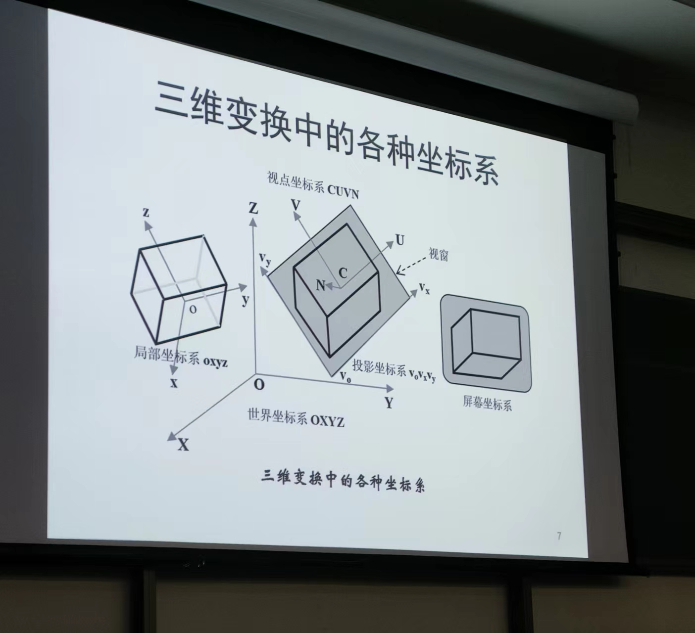
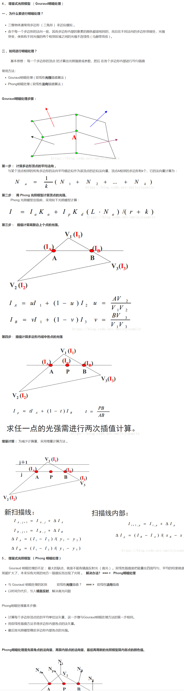
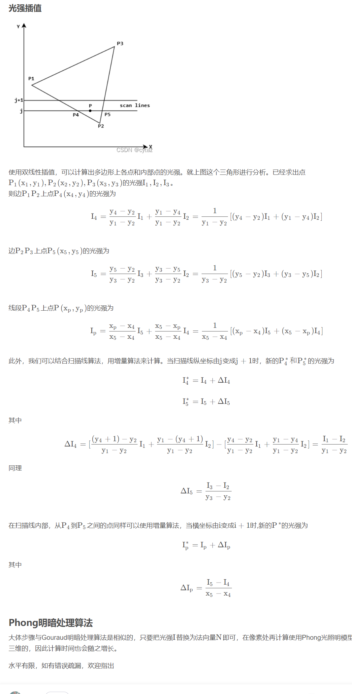

**本提纲目的：秉承一天入门，两天精通，三天上岗的原则，纯纯应付考试，如需深入，请联系作者。**

考试内容：
一道简答题，两道详细说明题，两道计算题(二维、三维转换)，一道编程题

计划：
- 周六  完成复习内容的总结
- 周日 对总结的进行记忆  自行计算（回归课本）
- 周一 重新浏览本提纲
- 周二 再次记忆 看自己能否单独使用公式写出计算  以及编程题
- 周三 考前再次背下 重点的内容   

# 一、概论

**P1**  
计算机图形学时一门研究如何利用计算机表示、生成、显示和处理图形的学科。图形通常由点、线、面、体等几何元素和颜色、纹理、线型、线宽等非几何属性描述。
图形分两类：一是基于线条信息表示的，二是真实感图形
P9  
程序题（注意init()函数：1.启动深度测试 2为场景添加一个光源 3定义物体的材质属性）

**P10  P11（对比光栅扫描的优缺点）**

- 光栅显示器上的图像是由光栅形成的。光栅是一组互相平行的水平扫描线，每行扫描线是由大小一致的显示单元组成的显示序列，每一显示单元称为一个像素，可显示给定的颜色和灰度。所以，光栅存储为一个代表了整个屏幕区域的像素矩阵。
- 随机扫描是与光栅扫描相对的另外一种扫描方式。本质是按照显示命令的任意顺序，将电子束从一个端点传到另外一个端点。
- 与向量图形相比，**光栅图形优点为具有对显示区域填充颜色或图案的能力**。
- 光栅显示器存储图形**易于操作，可对单独的像素进行读或写操作**。
- 与向量系统相比，光栅系统**难以画出边界光滑清晰的斜线和曲线**。（**走样**）
- 光栅化：确定最佳逼近图形的像素集合，并用指定的颜色和灰度设置像素的过程叫做图形的扫描转换。

## 另一种复习  （来源：https://github.com/Clear-Love/Note/blob/main）
- 计算机图形学概念 计算机图形学是⼀⻔研究如何利⽤计算机表示、⽣成、显示和处理图形的学科。
    
- 图形的概念 图形通常由点、线、⾯、体等⼏何元素和颜⾊、纹理、线型、线宽等⾮⼏何属性描述。
    
- 图形学的应用领域 计算机图形已被⼴泛⽤于各个不同的领域，如影视、游戏、⼯业设计、科学研究、艺术、医学、⼴告、教育、军事等
    
- 什么是像素 光栅显示器上的图像是由光栅 (raster) 形成的。栅是一组互相平行的水平扫描线，每行扫描线是由大小一致的显示单元组成的显示序列，每一显示单元称为一个像素
    
- 什么是光栅扫描 整幅图像由视频控制器按照从上到下然后再跳回顶部的顺序逐行扫描(见图 1.17)。在每个像素上，电子束激活荧光粉，使之产生给定的亮度;彩色系统中，三个电子束分别对应红、绿、蓝三原色，使其强度与每个像素值的三个颜色分量值相一致。
    
- 光栅扫描和随机扫描的差异和优势
    
    光栅扫描（Raster Scan）和随机扫描（Random Scan）是计算机图形学中两种常见的扫描方式。它们在显示设备的工作原理和应用方面存在差异和各自的优势。
    
    光栅扫描是指将图像分成水平线（光栅）并逐行扫描显示的方法。具体而言，电子束从屏幕的左上角开始，沿着一行一行的路径扫描，从而逐像素地显示图像。光栅扫描是CRT（阴极射线管）显示器和液晶显示器等传统显示技术的基本工作原理。
    
    随机扫描是指通过仅绘制图形所需的部分像素来显示图像。相对于光栅扫描的逐行扫描，随机扫描更加灵活，可以选择性地绘制需要的像素，从而提高绘图效率。随机扫描通常与矢量显示器相关联，这种显示器能够直接绘制直线和曲线，而不需要逐像素地扫描整个图像。
    
    下面是光栅扫描和随机扫描的差异和各自的优势：
    
    1. 差异：
        
        - 光栅扫描是逐行扫描，而随机扫描是选择性地绘制部分像素。
        - 光栅扫描通常与像素密集的位图图像相关联，而随机扫描通常与矢量图像相关联。
        - 光栅扫描显示设备的刷新率是固定的，而随机扫描可以根据需要调整绘制速度。
    2. 优势：
        
        - 光栅扫描可以更准确地显示复杂的图像和细节，因为它逐像素地扫描和显示整个图像。
        - 光栅扫描适用于静态和动态图像，并且可以呈现高质量的图像和视频。
        - 随机扫描在处理矢量图形和绘制直线、曲线等几何图形方面更高效，因为它只需绘制所需的像素，减少了计算量和存储需求。

总之，光栅扫描适用于静态和复杂图像的显示，能够提供高质量的图像和视频显示效果。而随机扫描适用于矢量图形的处理和绘制，能够提高绘图效率。选择使用哪种扫描方式取决于应用需求、图像类型以及所用显示设备的性能和特点

# 二、物体的几何表示

- 物体的多边形表示通常由顶点表、纹理表、法向表、面片表等组成。
**P24~P27** **重点**（**P27的公式 2.14  如下图**）





# 三、变换与裁剪

**P42**  三个二维变换公式（要熟悉）（要学会求不在原点的时候的三种变换【还未整理】）
- 平移、旋转和缩放不具有交换性，但具有结合性。
- 基于上述三种变换的组合，可以得到特殊的二维符变换，例如对称、剪切、刚体变换、放射变换。

```
二维变换旋转可以通过以下思路实现：
1. 确定旋转中心：首先需要确定旋转的中心点，可以是原点(0, 0)或任意其他点。
2. 平移到旋转中心：将需要进行旋转的点坐标平移到旋转中心所在的位置，使得旋转中心成为坐标系的原点  
3. 应用旋转变换：根据旋转角度，应用旋转变换来对平移后的点进行旋转。旋转变换可以使用旋转矩阵或复数形式来表示。
4. 平移回原始位置：将旋转后的点坐标再平移到原始坐标系中，使得旋转中心回到原来的位置。
```
```
要将点P(3, 4)绕旋转中心C(1, 2)逆时针旋转45度，可以使用矩阵表示来进行计算。以下是具体的步骤：

1. 平移到旋转中心： 将点P的坐标平移到旋转中心C(1, 2)的位置，得到平移后的点P'：
P' = P - C = (3, 4) - (1, 2) = (2, 2)
    
2. 应用旋转矩阵： 逆时针旋转45度的旋转矩阵如下所示： 
R = | cos(45°) -sin(45°) | 
    | sin(45°) cos(45°) | 
    = | sqrt(2)/2 -sqrt(2)/2 | 
      | sqrt(2)/2 sqrt(2)/2 | 
      将平移后的点P'表示为一个列向量，并与旋转矩阵R相乘，得到旋转后的点P''：
	  P'' = R * P' = | sqrt(2)/2 -sqrt(2)/2 | * (2, 2)
	                 | sqrt(2)/2 sqrt(2)/2 |
				   = (0, 2*sqrt(2))
    
3. 平移回原始位置： 将旋转后的点P''的坐标平移到原始位置，即加上旋转中心的坐标C(1, 2)，得到最终的旋转后的点P'''：
4. P''' = P'' + C = (0, 2_sqrt(2)) + (1, 2) = (1, 2 + 2_sqrt(2))
    

综合起来，将点P(3, 4)绕旋转中心C(1, 2)逆时针旋转45度后，可以用矩阵表示为： P''' = (1, 2 + 2*sqrt(2))
```

**P44~P45**  三维坐标变换公式
- 常见的投影变换有两类：一类是透视投影，这类投影符合人类的视觉，产生的投影效果真实。另一类是平行投影，物体的相对度量保持不变。

重点：




**P56-P57** 
- 基于连贯性的多边形扫描转换算法步骤：1求交2 排序3配对4填色  
（具体实现代码请看https://github.com/twj1206/OpenGL_Lab/tree/main/Scanline）
- 多边形扫描算法(会计算分类边表就可以)
**P59**
- z缓冲器消隐算法  （背诵它的描述）

定义：z缓冲器算法属于图像空间算法。z缓冲器是帧缓存的推广，在帧缓存中存储的是像素的颜色属性，二z缓冲器中存储的是对应像素中可见的z值。在消隐过程中，计算投影到当前像素上各表面采样点的深度值，并将它们与z缓冲器中该像素上已存储的当前可见点的深度值相比较，如果前者较大，则将相应采样点置为当前可见点并将其颜色写入缓存，更新z缓冲器存储的深度值。（还有它的算法描述，必须能默写）

**P74**
- Gouraud明暗处理  图(b)计算光照亮度 




