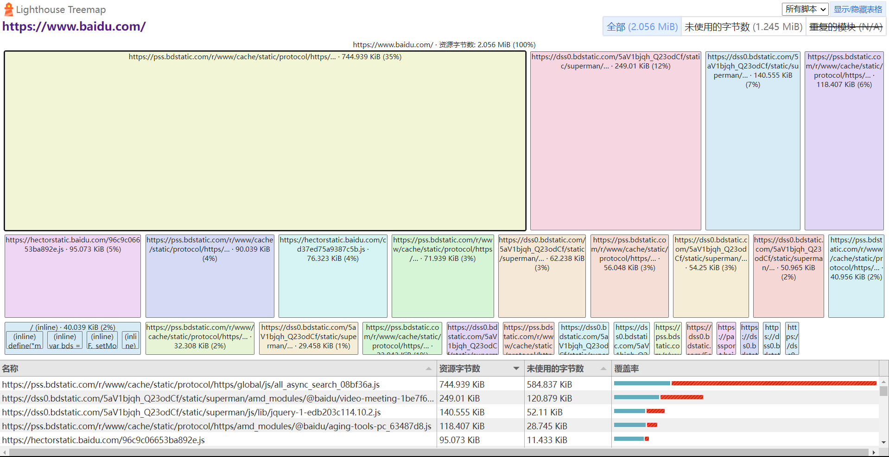
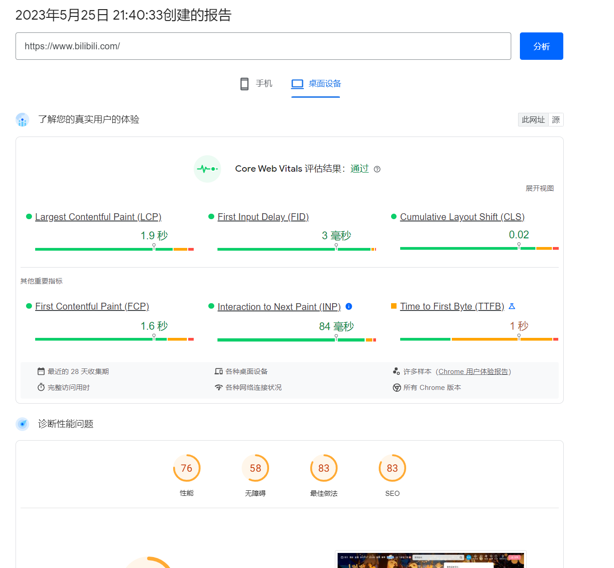
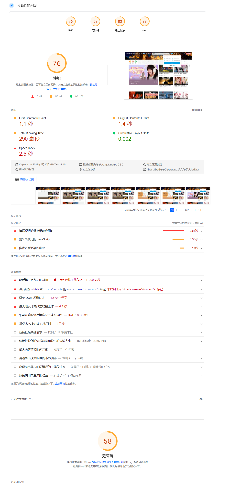
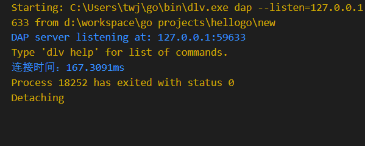
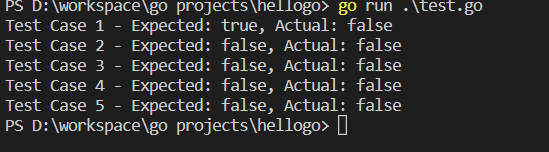

# 实验目的

应用 Web 测试工具对 Web 系统进行功能和性能测试；

# 实验原理

对 Web 系统测试需要从功能、性能、可用性、安全性等多方面进行测试。
### 一、 功能测试
对 Web 系统进行功能测试包括以下几个方面：
#### 1. 链接测试
```
链接是 Web 应用系统的一个主要特征，它是在页面之间切换和指导用户去一些不知道地址的页面的主要手段。 链接测试可分为三个方面。 首先， 测试所有链接是否按指示的那样确实链接到了该链接的页面；其次，测试所链接的页面是否存在；最后，保证 Web 应用系统上没有孤立的页面，所谓孤立页面是指没有链接指向该页面
```
#### 2.表单测试
```
当用户给 Web 应用系统管理员提交信息时，就需要使用表单操作，例如用户注册、登陆、信息提交等。在这种情况下，我们必须测试提交操作的完整性，以校验提交给服务器的信息的正确性。 例如： 用户填写的出生日期与职业是否恰当， 填写的所属省份与所在城市是否匹配等。 如果使用了默认值， 还要检验默认值的正确性。 如果表单只能接受指定的某些值，则也要进行测试。例如：只能接受某些字符，测试时可以跳过这些字符，看系统是否会报错。
```
#### 3. Cookies 测试
```
Cookies 通常用来存储用户信息和用户在应用系统的操作，当一个用户使用 Cookies 访问了某一个应用系统时， Web 服务器将发送关于用户的信息， 把该信息以 Cookies 的形式存储在客户端计算机上，这可用来创建动态和自定义页面或者存储登陆等信息。如果 Web 应用系统使用了 Cookies ，就必须检查 Cookies 是否能正常工作。 测试的内容可包括 Cookies 是否起作用，是否按预定的时间进行保存，刷新对 Cookies 有什么影响等。
```
#### 4.数据库测试
```
在 Web 应用技术中，数据库起着重要的作用，数据库为 Web 应用系统的管理、运行、查询和实现用户对数据存储的请求等提供空间。在使用了数据库的 Web 应用系统中，一般情况下，可能发生两种错误，分别是数据一致性错误和输出错误。 数据一致性错误主要是由于用户提交的表单信息不正确而造成的， 而输出错误主要是由于网络速度或程序设计问题等引起的， 针对这两种情况， 可分别进行测试。
```
### 二、性能测试

对 Web 系统进行性能测试主要包括以下几个方面
#### 1. 连接速度测试
```
用户连接到 Web 应用系统的速度根据上网方式的变化而变化，他们或许是电话拨号，或是宽带上网。当下载一个程序时，用户可以等较长的时间，但如果仅仅访问一个页面就不会这样。如果 Web 系统响应时间太长（例如超过 5 秒钟），用户就会因没有耐心等待而离开。 另外，有些页面有超时的限制，如果响应速度太慢，用户可能还没来得及浏览内容，就需要重新登陆了。而且，连接速度太慢，还可能引起数据丢失，使用户得不到真实的页面。
```
#### 2. 负载测试
```
负载测试是为了测量 Web 系统在某一负载级别上的性能，以保证 Web 系统在需求范围内能正常工作。 负载级别可以是某个时刻同时访问 Web 系统的用户数量， 也可以是在线数据处理的数量。 例如： Web 应用系统能允许多少个用户同时在线？如果超过了这个数量，会出现什么现象？ Web 应用系统能否处理大量用户对同一个页面的请求？
```
#### 3. 压力测试
```
进行压力测试是指实际破坏一个 Web 应用系统， 测试系统的反映。 压力测试是测试系统的限制和故障恢复能力， 也就是测试 Web 应用系统会不会崩溃， 在什么情况下会崩溃。黑客常常提供错误的数据负载， 直到 Web 应用系统崩溃， 接着当系统重新启动时获得存取权。
压力测试的区域包括表单、登陆和其他信息传输页面等。
```
### 三、 可用性测试
#### 1. 导航测试
```
导航描述了用户在一个页面内操作的方式。 通过考虑下列问题， 可以决定一个 Web 应用系统是否易于导航：导航是否直观？ Web 系统的主要部分是否可通过主页存取？ Web 系统是否需要站点地图、搜索引擎或其他的导航帮助？
```
#### 2. 图形测试
```
一个 Web 应用系统的图形可以包括图片、动画、边框、颜色、字体、背景、按钮等。
图形测试的内容有：
（1） 确保图形有明确的用途，图片或动画不要胡乱地堆在一起，以免浪费传输时间。
（2） 验证所有页面字体的风格是否一致。
（3） 背景颜色应该与字体颜色和前景颜色相搭配。
（4） 图片的大小和质量也是一个很重要的因素，一般采用 JPG 或 GIF 压缩。
```
#### 3. 内容测试
```
内容测试用来检验 Web 应用系统提供信息的正确性、准确性和相关性。
```
#### 4. 整体界面测试
```
整体界面是指整个 Web 应用系统的页面结构设计， 是给用户的一个整体感。 对整体界面的测试过程， 其实是一个对最终用户进行调查的过程。 一般 Web 应用系统采取在主页上做一个调查问卷的形式，来得到最终用户的反馈信息
```

# 实验内容

### 题目一：测试网站功能  选择一 个网站 ，对 其进行 功能 测试。 要求 首先编 写测 试用例 ，然 后用QuickTest Professional 自动化测试工具对该网站进行测试

在百度上进行百度账号（https://passport.baidu.com/）注册测试

**速度测试程序：**
```
package main
import (
    "context"
    "fmt"
    "net/http"
    "time"
)

func main() {
    url := "https://mail.qq.com/"
    // 创建一个带有超时的上下文
    ctx, cancel := context.WithTimeout(context.Background(), 5*time.Second)
    defer cancel()
    // 创建一个channel用于接收响应结果
    result := make(chan string)
    go func() {
        startTime := time.Now()
        resp, err := http.Get(url)
        endTime := time.Now()
        if err != nil {
            fmt.Printf("连接失败：%s\n", err.Error())
            return
        }
        defer resp.Body.Close()
        duration := endTime.Sub(startTime)
        //fmt.Printf("连接时间：%s\n", duration)
        result <- fmt.Sprintf("连接时间：%s", duration)
    }()
    select {
    case res := <-result:
        fmt.Println(res)
    case <-ctx.Done():
        fmt.Println("连接超时")
    }
}
```
**等价类划分**：

| 输入条件    | 有效等价类    | 编号    | 无效等价类   | 编号    |
|-------|-------|-------|-------|-------|
|用户名长度|   3-7  |            1|         <3|  5 |
|        |  |                      |         >7 | 6 |
|手机号长度|      11|             2|!=11|          7|
|密码长度|       8-14|            3|         <8|8|
|        |           |             |          >14|9|
|验证码长度|      6|                4|         !=6|10| 

**设计测试用例**

| 用户名|手机号|       密码|    验证码  | 预期结果 | 覆盖的有效等价类 |覆盖的无效等价类|
|-------|-------    |------- |-------   |-------|-------|-------|
|abc1234|12345678901|12345678|  123456   |true   |  1，2，3，4|    |
|ab     |12345678901|12345678|1234556|    false|   2，3，4|5|
|abc12345|12345678901|123      |123456   |   false  |2，4|6，8|
|abc1234|123456|     123456789012345|   123456|false|1，4|7，9|
|abc1234|12345678901| 12345678|1234|         false|1，2，3|10|

**测试程序**
```
package main
import (
    "fmt"
    "net/http"
    "net/url"
    "time"
)

type TestCase struct {
    Username           string
    PhoneNumber        string
    Password           string
    VerificationCode   string
    ExpectedResult     bool
    ValidEquivalence   []int
    InvalidEquivalence []int

}
func main() {
    testCases := []TestCase{
        {
            Username:           "abc1234",
            PhoneNumber:        "12345678901",
            Password:           "12345678",
            VerificationCode:   "123456",
            ExpectedResult:     true,
            ValidEquivalence:   []int{1, 2, 3, 4},
            InvalidEquivalence: []int{},
        },
        {
            Username:           "ab",
            PhoneNumber:        "12345678901",
            Password:           "12345678",
            VerificationCode:   "1234556",
            ExpectedResult:     false,
            ValidEquivalence:   []int{2, 3, 4},
            InvalidEquivalence: []int{5},
        },
        {
            Username:           "abc12345",
            PhoneNumber:        "12345678901",
            Password:           "123",
            VerificationCode:   "123456",
            ExpectedResult:     false,
            ValidEquivalence:   []int{2, 4},
            InvalidEquivalence: []int{6, 8},
        },
        {
            Username:           "abc1234",
            PhoneNumber:        "123456",
            Password:           "123456789012345",
            VerificationCode:   "123456",
            ExpectedResult:     false,
            ValidEquivalence:   []int{1, 4},
           InvalidEquivalence: []int{7, 9},
        },
        {
            Username:           "abc1234",
            PhoneNumber:        "12345678901",
            Password:           "12345678",
            VerificationCode:   "1234",
            ExpectedResult:     false,
            ValidEquivalence:   []int{1, 2, 3},
            InvalidEquivalence: []int{10},
        },
    }


    for i, testCase := range testCases {
        result := registerUser(testCase)
        fmt.Printf("Test Case %d - Expected: %v, Actual: %v\n", i+1, testCase.ExpectedResult, result)
    }
}

func registerUser(testCase TestCase) bool {

    registerurl := "https://www.baidu.com/register" // 替换为实际注册页面的URL

    formData := url.Values{}
    formData.Set("username", testCase.Username)
    formData.Set("phone", testCase.PhoneNumber)
    formData.Set("password", testCase.Password)
    formData.Set("code", testCase.VerificationCode)
    client := http.Client{
       Timeout: 5 * time.Second,
    }
    resp, err := client.PostForm(registerurl, formData)
    if err != nil {
        fmt.Printf("连接失败：%s\n", err.Error())
        return false
    }
    defer resp.Body.Close()
    // 检查注册结果是否与预期一致
    // 这里简化为检查响应状态码为200即表示成功
    return resp.StatusCode == http.StatusOK
}
```

测试



### 题目二：测试网站性能

选择一个网站， 对其进行性能测试。 要求使用 WebLoad 进行压力测试

#### 网站加载数据的测试结果



#### 网站各项性能指标


# 四、测试结果


题目一：对网站注册进行测试
连接测试：





# 五、总结报告

题目一：

实验中设计等价类的时候还是较为简单，但在使用测试用例对网站的注册进行测试时候还是较为困难，代码的编写量较大，也稍微有些难度。其次，在实验中，对测压工具的实验有较为困难，QTP工具的使用对网站测试较为困难，主要是总是存在不会操作的地方，特别是如何使用测试用例来测试各种测试，但经过具体的操作，逐渐能测出一点东西。

题目二：

测试：性能测试 - Core Web Vitals 分析工具
- 缺陷4：性能指标不一致或错误的建议。
- 重现步骤：运行Core Web Vitals 工具并检查报告中的性能指标和优化建议。
- 预期结果：报告中提供准确的性能指标和有效的优化建议。
- 实际结果：发现一些性能指标不一致或错误的优化建议，并且额能诊断不同情况
- 严重程度：中等
