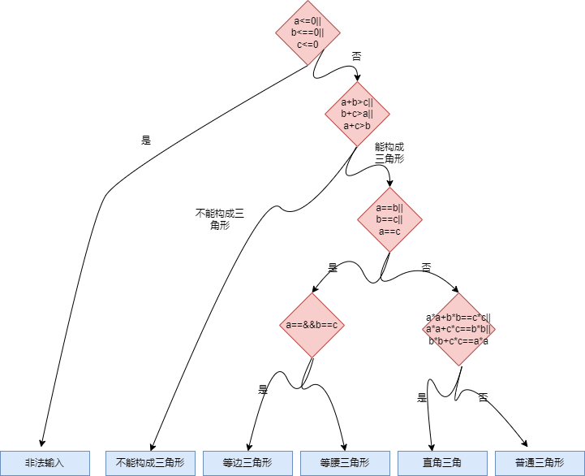
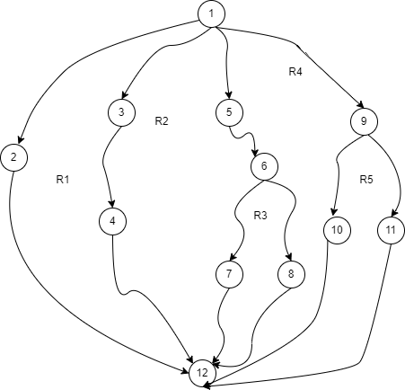
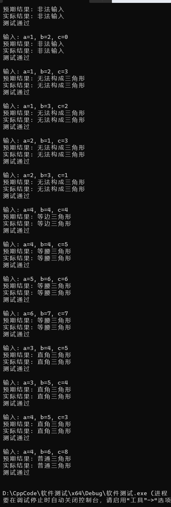

# 实验目的:

1. 掌握白盒测试技术，并能应用白盒测试技术设计测试用例；
2. 对测试用例进行优化设计；


# 实验原理

白盒测试是知道产品内部工作过程，检测产品内部动作是否按照规格说明书的规定正  常进行。 白盒测试允许测试人员利用程序内部的逻辑结构及有关信息，设计或选择测试用例，对程序所有逻辑路径进行测试。通过在不同点检查程序的状态，确定实际的状态是否与预期的状态一致。

1、逻辑覆盖

白盒测试力求提高测试覆盖率。逻辑覆盖是对一系列测试过程的总称，它是在使用白盒测试法时，选用测试用例执行程序逻辑路径的方法。

逻辑覆盖按覆盖程度由低到高大致分为以下几类：

（1）语句覆盖：语句覆盖就是设计若干个测试用例，运行被测程序，使得每一可执行语句至少执行一次；

（2）判断覆盖：

•判定覆盖就是设计若干个测试用例，运行被测程序，使得程序中每个判断的取真分支和取假分支至少经历一次；

•判定覆盖又称为分支覆盖；

（3）条件覆盖：往往大部分的判定语句是由多个逻辑条件组合而成，若仅仅判断其整个最终结果，而忽略每个条件的取值情况，必然会遗漏部分测试路径。判定覆盖仍是弱的逻辑覆盖；

（4）判断 /条件覆盖：

•判定/条件覆盖实际上是将判定覆盖和条件覆盖结合起来的一种方法；  
•就是设计足够的测试用例，使得判断中每个条件的所有可能取值至少执行一次，同时每个判定的可能结果也至少出现一次；  
•设计测试用例覆盖4个条件的8种取值以及4个判定分支；

（5）条件组合覆盖。条件组合覆盖就是设计足够的测试用例，运行被测程序，使得每个判断的所有可能的条件取值组合至少执行一次；

（6）路径覆盖。设计足够的测试用例，使程序的每条可能路径都至少执行一次。 如果把路径覆盖和条件组合覆盖结合起来，可以设计出过检错能力更强的测试数据用例。

路径测试就是从一个程序的入口开始，执行所经历的各个语句的完整过程。从广义的角度讲，任何有关路径分析的测试都可以被称为路径测试。独立路径是指从程序的入口到出口的多次执行中，每次至少有一个语句是新的，未被重复的，也即每次至少要经历一条从末走过的路。

在不能做到所有路径覆盖的前提下，如果某一程序的每一个独立路径都被测试过，那么可以认为程序中的每个语句都已经检验过了，即达到了语句覆盖。这种测试方法就是基本路径测试方法。

基本路径测试方法是在控制流图的基础上，通过分析控制结构的环形复杂度，导出执行路径的基本集，再从该基本集设计测试用例。

基本路径测试方法包括4个步骤：

（1）画出程序的控制流图。

（2）计算程序的环形复杂度，导出程序基本路径集中的独立路径条数，确定程序中每个可执行语句至少执行一次所必须的测试用例数目的上界。

（3）导出基本路径集，确定程序的独立路径。独立路径至少包含一条在之前不曾用到的边。

（4）根据（3）中的独立路径，设计测试用例的输入数据和预期输出。

控制流图（简称流图）是对程序流程图进行简化后得到的，它可以更加突出的表示程序控制流的结构。控制流图中包括两种图形符号：

①节点

节点由带标号的圆圈表示，可代表一个或多个语句、一个处理框序列和一个条件判定框（假设不包含复合条件）。

节点表示一个或多个无分支的语句或源程序语句。

②控制流线

控制流线由带箭头的弧或线表示，可称为边。它代表程序中的控制流。对于复合条件，则可将其分解为多个单个条件，并映射成控制流图。

 

常见结构的控制流图

 

程序流程图与对应的控制流图

③环形复杂度

环形复杂度也称为圈复杂度，它是一种为程序逻辑复杂度提供定量尺度的软件度量。应用：进行程序的基本路径测试时，程序的环路复杂性给出了程序基本路径集合中的独立路径条数，这是确保程序中每个可执行语句至少执行一次所必须的测试用例数目的上界。

进行程序的基本路径测试时，程序的环路复杂性给出了程序基本路径集合中的独立路径条数，这是确保程序中每个可执行语句至少执行一次所必需的测试用例数目的上界。

环形复杂度以图论为基础，为我们提供了非常有用的软件度量。可用如下三种方法之一来计算环形复杂度。

控制流图中区域的数量对应于环形复杂度。

给定控制流图G的环形复杂度——V(G)，定义为V(G) = E-N+2,其中，E是控制流图中边的数量，N是控制流图中的节点数量。

给定控制流图G的环形复杂度——V（G），也可定义为V（G）= P+1,其中，P是控制流图G中判定节点的数量

```
void DoWork(int x, int y, int z)
{
	int k = 0, j = 0;
	if ((x > 3) && (z < 10))
		{
		k = x * y - 1;
		j = sqrt(k);
		}
	if ((x == 4) || (y > 5))
		j = x * y + 10;
	j = j % 3;
}
```

![[xx.png]]


#### 语句覆盖
（在语句覆盖测试用例中，使程序中每个可执行语句至少被执行一次。）

- 测试用例

| 测试用例|覆盖路径|预期结果|
|-------|-------|-------|
|x=4,y=6,z=7|1->2->3->4->5->6->7->8->9->10|k=23 j=1|

#### 判定覆盖
(使得每个判定语句的取值都满足各有一次“真”与“假”)

| 测试用例|覆盖路径|预期结果|
|-------|-------|-------|
|x=4,y=6,z=7|1->2->3->4->5->6->7->8->9->10|k=23 j=1|
|x=5,y=4,z=4|1->2->3->4->5->6|k=19,j=1|
|x=2,y=6,z=11|7->8->9->10|k=0.j=1|
|x=2,y=2,z=11|1->10|k=0,j=0|

#### 条件覆盖

```
设计测试用例时，要保证每种状态都至少出现一次。设计测试用例的原则是尽量以最少的测试用例达到最大的覆盖率
```

- 条件列表

| 条件一|条件标记|条件二|条件标记|
|--------|-------|-------|------|
|x>3       |S1|    z<10|    S3|
|x<=3|      -S1|    z>=10|-S3|
|x等于4|     S2|     y>5|    S4|
|x!=4|      -S2|    y<=5|   -S4|

-   测试用例

| 测试用例|条件标记|覆盖路径|预期结果|
|-------|-------|-------|-------|
|x=4,y=6,z=7|S1 S2 S4 S3|1->2->3->4->5->6->7->8->9->10|k=23 j=1|
|x=5,y=4,z=4|S1 -S2 -S4 S3 |1->2->3->4->5->6|k=19,j=1|
|x=2,y=6,z=11|-S1 -S2 -S3-S4 |7->8->9->10|k=0.j=1|
|x=2,y=2,z=11|-S1 -S2 -S3 -S4|1->10|k=0,j=0|

#### 判断/条件覆盖
设计用例，使得判断中的每个条件的所有可能结果至少出现一次，而且判断本身所有可能结果也至少出现一次

| 测试用例|条件标记|覆盖路径|预期结果|
|-------|-------|-------|-------|
|x=4,y=6,z=7|S1 S2 S4 S3|1->2->3->4->5->6->7->8->9->10|k=23 j=1|
|x=5,y=4,z=4|S1 -S2 -S4 S3 |1->2->3->4->5->6|k=19,j=1|
|x=2,y=6,z=11|-S1 -S2 -S3 S4 |7->8->9->10|k=0.j=1|
|x=2,y=2,z=11|-S1 -S2 -S3 -S4|1->10|k=0,j=0|

#### 条件组合覆盖
```
1. 设计足够多的测试用例，使判定语句中每个条件的所有可能至少出现一次，并且每个判定语句本身的判定结果也至少出现一次   
2. 由于四个条件每个条件都有取“真”、“假”两个值，因此所有条件结果的组合有pow(2,4)=16种
```

| 序号|   组合    |测试用例|预期结果|
|-----|-----      |-------|------|
|1    |S1，S2，S3，S4  | x=4，y=6，z=7  |k=23 j=1 |
|2    | -S1，S2，S3，S4 | 不可能 |      |
|3    |S1，-S2，S3，S4 |  x=5，y=6，z=6 | k=29 j=1 |
|4    |S1，S2，-S3，S4|x=4，y=6,z=11|k=0,j=1 |
|5    |S1，S2，S3，S4|x=4,y=6,z=6|k=23,j=1|
|6    |-S1，-S2，S3, S4 | x=2,y=6,z=6|      k=0,j=1|
|7    |-S1，S2，-S3，S4 | 不可能 |      |
|8   |-S1，S2，S3，-S4|不可能|      |
|9    |S1，-S2，-S3，S4|x=5,y=6,z=11| k=0,j=1 |
|10    |S1，S2，-S3，-S4|x=4,y=4,z=11|k=0,j=2|
|11    | S1，-S2，S3，-S4 |x=5,y=4,z=9|k=19,j=1|
|12    |-S1，-S2，-S3，S4 |x=2,y=6,z=9| k=0,j=1|
|13    |-S1，-S2，S3，-S4 |x=2,,y=4,z=11|k=0,j=0|
|14    |S1，-S2，-S3，-S4|x=5,y=4,z=16|k=0,j=0 |
|15    |-S1，S2，-S3，-S4|不可能 |      |
|16    |-S1，-S2，-S3，-S4|x=2，y=11，z=4 |k=0，j=2|

- **被测程序**
```
#include<iostream>
#include<cmath>
#include<vector>
using namespace std;
int k = 0, j = 0;
struct Testcase {
	int index;
	int x;
	int y;
	int z;
	int expectedK;
	int expectedJ;
};
vector<Testcase> testcases = {
		{1, 4, 6, 7, 23, 1},
		{2, 0, 0, 0, 0, 0},
		{3, 5, 6, 6, 29, 1},
		{4, 4, 6, 11, 0, 1},
		{5, 4, 6, 6, 23, 1},
		{6, 2, 6, 6, 0, 1},
		{7, 0, 0, 0, 0, 0},
		{8, 0, 0, 0, 0, 0},
		{9, 5, 6, 11, 0, 1},
		{10, 4, 4, 11, 0, 2},
		{11, 5, 4, 9, 19, 1},
		{12, 2, 6, 9, 0, 1},
		{13, 2, 4, 11, 0, 0},
		{14, 5, 4, 16, 0, 0},
		{15, 0, 0, 0, 0, 0},
		{16, 2, 11, 4, 0, 2}
};
void DoWork(int x, int y, int z)
{
	int k = 0, j = 0;
	if ((x > 3) && (z < 10))
	{
		k = x * y - 1;
		j = sqrt(k);
	}
	if ((x == 4) || (y > 5))
		j = x * y + 10;
	j = j % 3;
	cout << "k=" << k << ",j=" << j << endl;
}
void printTestCases(const vector<Testcase>& testcases) {
	for (const auto& testcase : testcases) {
		int x = testcase.x;
		int y = testcase.y;
		int z = testcase.z;
		int expectedK = testcase.expectedK;
		int expectedJ = testcase.expectedJ;

		cout << "测试用例 " << testcase.index << ":" << endl;
		cout << "输入: x=" << x << ", y=" << y << ", z=" << z << endl;
		cout << "预期结果: k=" << expectedK << ", j=" << expectedJ << endl;

		cout << "实际结果: ";
		DoWork(x, y, z);
		cout << endl;

		if (expectedK == k && expectedJ == j) {
			cout << "测试通过" << endl;
		}
		else {
			cout << "测试失败" << endl;
		}

		cout << endl;
	}
}


int main() {
	printTestCases(testcases);

}
```

### 题目二：三角形问题

```
在三角形计算中，要求输入三角型的三个边长： A、B 和 C。当三边不可能构成三角形时提示错误，可构成三角形时计算三角形周长。若是等腰三角形打印“等腰三角形” ，若是等边三角形，则提示“等边三角形”。画出程序流程图、控制流程图、计算圈复杂度 V(g) ，找出基本测试路径

```

**测试程序**
```
string JudgeTriangle(int a, int b, int c) {
    if (a <= 0 || b <= 0 || c <= 0) {
        return "非法输入";
    }
    if (a + b <= c || a + c <= b || b + c <= a) {
        return "无法构成三角形";
    }
    else if (a == b || a == c || b == c) {
        if (a == b && b == c) {
            return "等边三角形";
        }
        else {
            return "等腰三角形";
        }
    }
    else if (a * a + b * b == c * c || a * a + c * c == b * b || b * b + c * c == a * a) {
        return "直角三角形";
    }
    else {
        return "普通三角形";
    }
}
```

**程序流程图**




**控制流程图** 
```
string JudgeTriangle(int a, int b, int c) {
    1   if (a <= 0 || b <= 0 || c <= 0) {  
    2   return "非法输入";
       }
    3   if (a + b <= c || a + c <= b || b + c <= a) {
    4    return "无法构成三角形";
       }
    5   else if (a == b || a == c || b == c) {
    6   if (a == b && b == c) {
    7        return "等边三角形";
        }
        else {
     8       return "等腰三角形";
        }
    }
    9   else if (a * a + b * b == c * c || a * a + c * c == b * b || b * b + c * c == a * a) {
    10   return "直角三角形";
       }
      else {
    11    return "普通三角形";
       }
    
	12     }
```



-   根据控制流图，边数E=1,6 结点数N=12，判断结点数P=5,`v(g)=E-N+2=6, v(g)=P+1=6`
-   由控制流图可得独立路径有

|编号|包含路径|
|-------|-------|
|1|     1->2->12|
|2|1->3->4->12|
|3|1->5->6->7->12|
|4|1->5->6->8->12|
|5|1->9->10->12|
|6|1->9->11->12|


|a，b，c|预期结果|覆盖路径编号|
|------|------|------|
|0，1，2|非法输入|1|
|1，0，2|非法输入|1|
|1，2，0|非法输入|1|
|1，2，3|无法构成三角形|2|
|1，3，2|无法构成三角形|2|
|2，1，3|无法构成三角形|2|
|2，3，1|无法构成三角形|2|
|4，4，4|等边三角形|3|
|4，4，5|等腰三角形|4|
|5，6，6|等腰三角形|4|
|6，7，7|等腰三角形|4|
|3，4，5|直角三角形|5|
|3，5，4|直角三角形|5|
|4，5，3|直接三角形|5|
|4，6，8|普通三角形|6|


- **测试程序**
```
#include <iostream>
#include <string>
#include <vector>
using namespace std;

struct Testcase {
    int a;
    int b;
    int c;
    string expected;
   
};

vector<Testcase> testcases = {
    {0, 1, 2, "非法输入"},
    {1, 0, 2, "非法输入"},
    {1, 2, 0, "非法输入"},
    {1, 2, 3, "无法构成三角形"},
    {1, 3, 2, "无法构成三角形"},
    {2, 1, 3, "无法构成三角形"},
    {2, 3, 1, "无法构成三角形"},
    {4, 4, 4, "等边三角形"},
    {4, 4, 5, "等腰三角形"},
    {5, 6, 6, "等腰三角形"},
    {6, 7, 7, "等腰三角形"},
    {3, 4, 5, "直角三角形"},
    {3, 5, 4, "直角三角形"},
    {4, 5, 3, "直角三角形"},
    {4, 6, 8, "普通三角形"}
};

string JudgeTriangle(int a, int b, int c) {
    if (a <= 0 || b <= 0 || c <= 0) {
        return "非法输入";
    }
    if (a + b <= c || a + c <= b || b + c <= a) {
        return "无法构成三角形";
    }
    else if (a == b || a == c || b == c) {
        if (a == b && b == c) {
            return "等边三角形";
        }
        else {
            return "等腰三角形";
        }
    }
    else if (a * a + b * b == c * c || a * a + c * c == b * b || b * b + c * c == a * a) {
        return "直角三角形";
    }
    else {
        return "普通三角形";
    }
}

void PrintTestcases(const vector<Testcase>& testcases) {
    for (const auto& testcase : testcases) {
        int a = testcase.a;
        int b = testcase.b;
        int c = testcase.c;
        string expected = testcase.expected;
       
        cout << "输入: a=" << a << ", b=" << b << ", c=" << c << endl;
        cout << "预期结果: " << expected << endl;

        string result = JudgeTriangle(a, b, c);
        cout << "实际结果: " << result << endl;
        if (result == expected) {
            cout << "测试通过" << endl;
        }
        else {
            cout << "测试未通过" << endl;
        }

        cout << endl;
    }
}

int main() {
    PrintTestcases(testcases);

    return 0;
}

```

# 实验结果

#### 题目二：三角形问题

